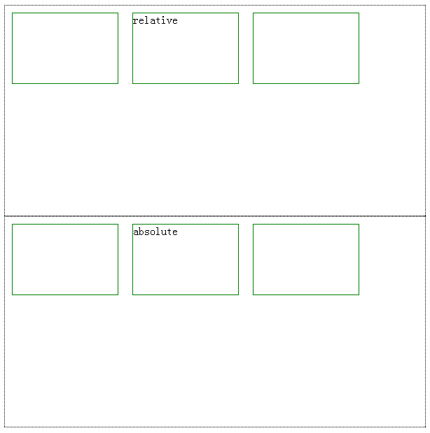
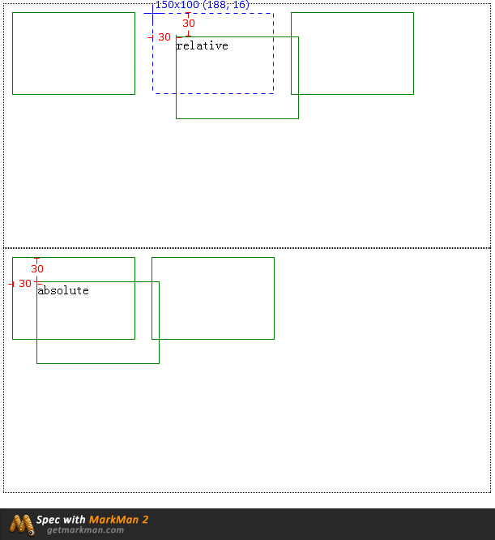

##相对定位与绝对定位
作者：*李梦仪*       
时间：*2016-10-18 13:46*

要想分清相对定位和绝对定位的差别，需要着眼于两点：移动的参照物和对普通文档流的影响。

**1、移动的参照物**

相对定位是“相对于”**元素（本身）**在文档流中的**初始位置**；而绝对定位是“相对于”距离它最近的**已定位祖先元素**（即设置了position样式属性的祖先元素），如果不存在已定位的祖先元素，那么相对于初始包含块（即浏览器）。

**2、对普通文档流的影响**

在使用相对定位是，无论是否移动，元素仍然占据原来的空间。
而与之相反，绝对定位使元素的位置与文档流无关，因此不占据空间。普通文档流中其它元素的布局就像绝对定位的元素不存在时一样。

看例子：

html结构
```html
	<div class="wrapper">
        <div class="box"></div>
        <div class="box relative">relative</div>
        <div class="box"></div>
    </div>

    <div class="wrapper">
        <div class="box"></div>
        <div class="box absolute">absolute</div>
        <div class="box"></div>
    </div>
```
初始css代码

```css
	.wrapper{
        width:600px;
        border:1px dotted black;
        height:300px;
        position: relative;
    }
    .box{
        width:150px;
        height:100px;
        margin:10px;
        border:1px solid green;
        float: left;
    }
```

初始效果：


定位css代码

```css
	.relative{
        position: relative;
        left:30px;
        top:30px;
    }
    .absolute{
        position: absolute;
        left:30px;
        top:30px;
    }
```

初始效果：



以上为个人见解，望指教。