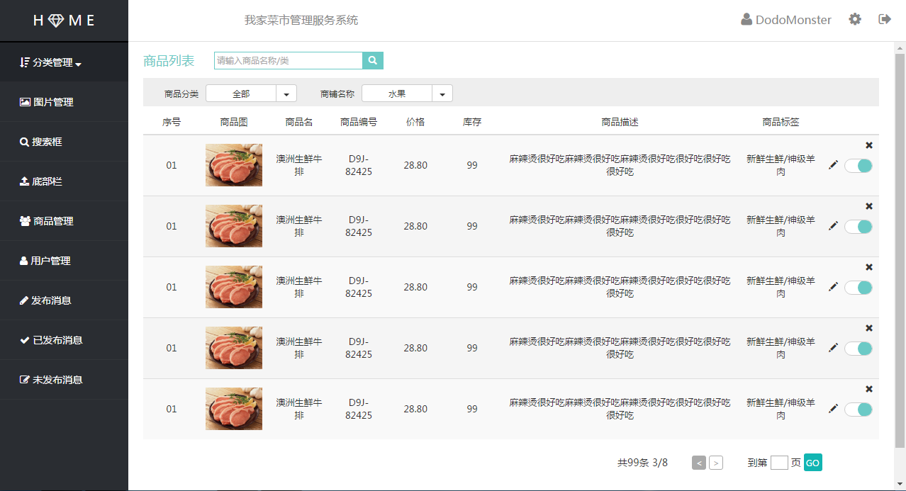

##总结1：学校工作室项目--我家菜市（后台网站）
作者：*李梦仪*       
时间：*2016-10-25 16:47*

**1、网页效果展示**

* 商品信息编辑页 
* 商品列表管理页 
* 商品评论管理页 
* 商品消息编辑页 
* 商品未发布消息管理页 
* 商品已发布消息管理页 

**2、后台网页框架搭建**

这个系列的网页都可看做由3个部分组成：


搭建步骤是：先分别实现由part 1(顶部 header.html)和part 2(左侧导航栏 asider.html)组成的所有页面的共同部分，然后通过`<frameset>、<frame>`标签分别引入这三个部分。例：
```html
<frameset cols="183px,*" framesetBorder="0" border=0>
    <frame src="./block/asider.html" name="asiderFrame" scrolling="no" noresize="noresize" id="asiderFrame">
    <frameset rows="60px,*">
        <frame src="./block/header.html" name="headerFrame" scrolling="no" noresize="noresize" id="headerFrame">
        <frame src="./views/****.html">
    </frameset>
</frameset>
```
这一部分需要注意的地方是：**`<body></body>` 标签与 `<frameset></frameset>` 标签不能同时使用！**即`<head></head>`标签后接`<frameset></frameset>`标签而不是`<body></body>` 标签。

**3、后台网页实现技术要点**

**读取文件，实现图片预览**

在商品信息编辑页面中，实现了商家选取本地图片文件上传并在特定位置实现预览的功能。

在这里的实现主要使用了**File API**。
>File API只是规定怎么从硬盘上提取文件，直接交给在网页中运行的JavaScript代码。然后代码可以打开文件探究数据，无论是文本文件还是其他文件。

>注意：File API不能修改文件，也不能创建新文件。

**File API实现文件读取的基本步骤是：**

获取input元素提供的文件合集中取得第一个文件；
创建FileReader的对象并调用FileReader的方法（`readAsDataURL()、readAsText()、readAsBinaryString()、readAsArrayBuffer()`）提取文件内容；
把内容（保存在onload事件的e.target.result）显示在特定区域中。（因为对象的方法是异步的，所以可以先实现数据的显示，再实现数据的提取和转换）


实现步骤：

1、取得文件
`<input type="file" name="goodsImg" accept="image" onchange="processFile(this.files)">`

2、processFiles函数的实现
```javascript
function processFile(files){
    var file = files[0];    //从input元素提供的文件合集中取得第一个文件
    var reader = new FileReader();  //创建FileReader对象，以便后面调用FileReader的方法提取文件内容
    reader.onload=function(e){  //这个事件发生时，意味着数据准备好了
        ...
        img.src = e.target.result;
        ...
    };
    reader.readAsDataURL(file); //这个方法会转换文件内容，并保存在e.target.result中
}
```

**未完待续。。。**

以上为个人见解，望指教。
